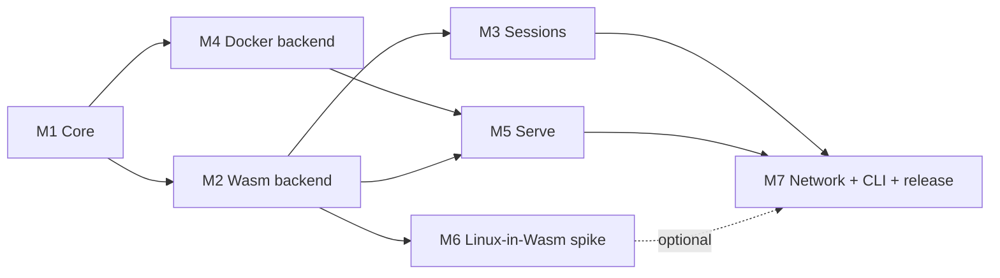

# github.com/micromax/sandbox — Project Plan

A Go library that runs **untrusted / AI-generated code** in isolation so the host machine stays safe.
Embeddable in any Go project. Supports many languages, REPL sessions, and serving network services.

## Decisions (agreed in discussion)

| Topic | Decision |
|---|---|
| Module path | `github.com/micromax/sandbox` |
| Threat model | Code is **untrusted**. Strong isolation is required. |
| Default backend | **Wasm** via [wazero](https://wazero.io) (pure Go, no CGO, no daemon) |
| Optional backend | **Docker/Podman** (opt-in) for languages with no good Wasm build |
| Experimental | **Linux-in-Wasm** (container2wasm) as a no-Docker route for "any language" |
| Sessions | REPL-style, stateful across `Eval` calls |
| Network | Optional, **off by default**, allow-list based |
| Serving | `Serve` exposes a guest port on the host, **loopback by default** |
| Platforms | Windows, Linux, macOS |
| Languages (first) | JavaScript, Python → then Java, Go, Rust, Ruby, Lua, shell |

## Documents

| # | Document | Milestone |
|---|---|---|
| 1 | [Architecture](01-architecture.md) | Foundations — read first |
| 2 | [M1 Core](02-m1-core.md) | Types, limits, VFS, `Run`, pack registry |
| 3 | [M2 Wasm backend](03-m2-wasm-backend.md) | wazero, JS + Python packs |
| 4 | [M3 Sessions](04-m3-sessions.md) | REPL sessions, manager |
| 5 | [M4 Docker backend](05-m4-docker-backend.md) | Hardened containers, more languages |
| 6 | [M5 Serve](06-m5-serve.md) | Exposing ports on the host |
| 7 | [M6 Linux-in-Wasm spike](07-m6-linux-in-wasm-spike.md) | Go/no-go experiment |
| 8 | [M7 Network, CLI, release](08-m7-network-cli-release.md) | Polish and v0.1.0 |
| 9 | [Security & testing strategy](09-security-and-testing.md) | Cross-cutting |
| 10 | [Pack distribution](10-pack-distribution.md) | How runtimes reach users |

## Milestone order and dependencies

## How every document is structured

Each milestone document has the same sections so progress is easy to verify:

1. **Goal** — what exists when the milestone is done
2. **Design** — key decisions and API
3. **Execution steps** — the exact ordered work I will do
4. **Deliverables** — files and packages produced
5. **Tests** — what proves it works
6. **Exit criteria** — checklist; the milestone is not done until all boxes are ticked
7. **Risks** — what could go wrong and the fallback

## Working agreement

- I work **one milestone at a time** and report at each exit-criteria checkpoint.
- Public API changes are called out explicitly before being made.
- Security-relevant defaults are never relaxed silently.
- You can stop or redirect after any milestone.
